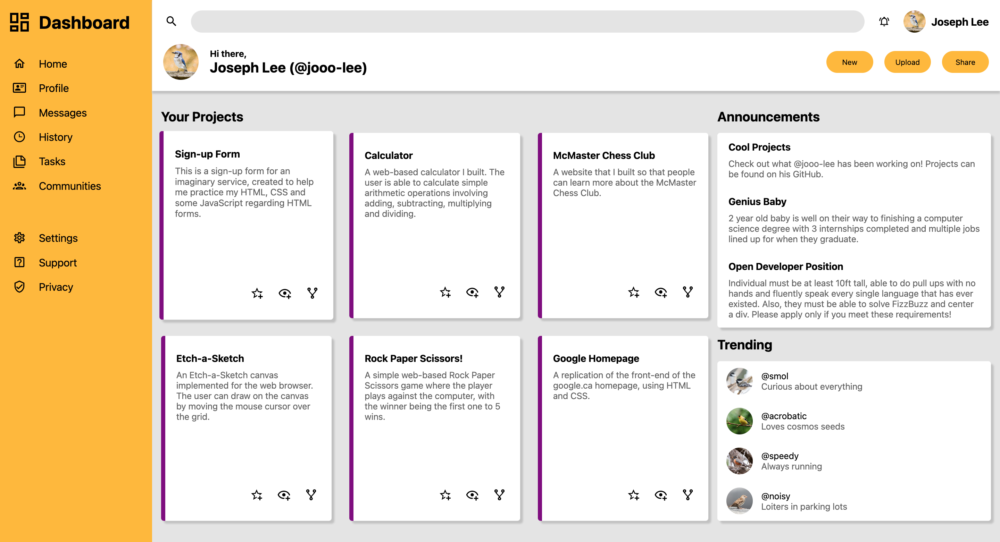
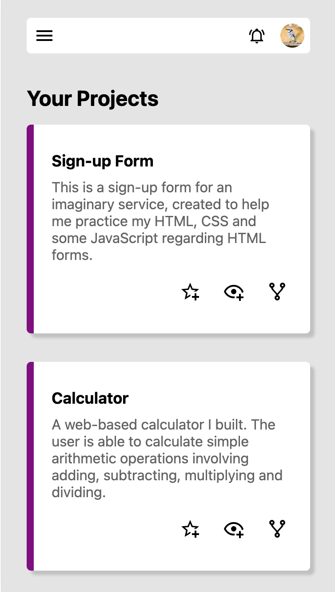

# Admin Dashboard

My implementation of the admin dashboard project for The Odin Project. Try it [here](https://jooo-lee.github.io/admin-dashboard/)!

## Description:

This is a responsive dashboard design that I made to practice my CSS Grid skills. 

For larger screens:

For smaller screens:

## Features:

* Animated, closeable side navigation menu to save space on smaller screens
* Different layout for smaller and larger screens
* Various hover effects to enhance user experience

## I learned how to:

* Use CSS Grid to create a responsive grid and align elements
* Use grid-template-rows and grid-template-columns to create rows and columns of varying sizes
* Use CSS variables to keep styling consistent and easy to modify if needed
* Use :nth-child(), :nth-of-type() and :nth-last-child() selectors to select child elements relative to sibling elements
* Prevent background colour from overflowing element with rounded corners
* Clip images to be circle shaped while maintaining aspect ratio using object-fit: cover
* Prevent sticky hover states after clicking on element for touch screen devices

## Issues:

* I wanted to have each of the project cards be clickable and potentially link somewhere, however each project card also contained icons that would potentially link elsewhere. Nesting anchor tags is invalid as of the time this is being written, and other alternatives seemed out of the scope of this project. So, I decided to just scale up the card and change the cursor to be a pointer when the user hovers over a project card.
* For the side navigation menu, I wanted to align all of the text, however I also wanted to combine the icon and the text to be contained in one link, rather than have them separate. It seemed difficult to achieve without hard coding certain spacing and it seemed like a small nitpick, however I may come back and fix this in the future. 

## Acknowledgements:

Icons and favicon from [Material Design Icons](https://pictogrammers.com/library/mdi/).

Bird profile pictures from varying photographers on [Unsplash](https://unsplash.com):
* [Blue Jay](https://unsplash.com/photos/9aly1wnAig0) by [Ruben Ortega](https://unsplash.com/@garigol).
* [Black-capped Chickadee](https://unsplash.com/photos/hVyw1-zjAhQ) by [Peter Lewis](https://unsplash.com/@speterlewis).
* [American Robin](https://unsplash.com/photos/iwdLcMUSby8) by [Trac Vu](https://unsplash.com/@tracminhvu).
* [American Goldfinch](https://unsplash.com/photos/bIz1pu4vd2g) by [Mark Olsen](https://unsplash.com/@markolsen).
* [House Sparrow](https://unsplash.com/photos/iL76TEh0RuA) by [Cédric VT](https://unsplash.com/@cedric_photography).